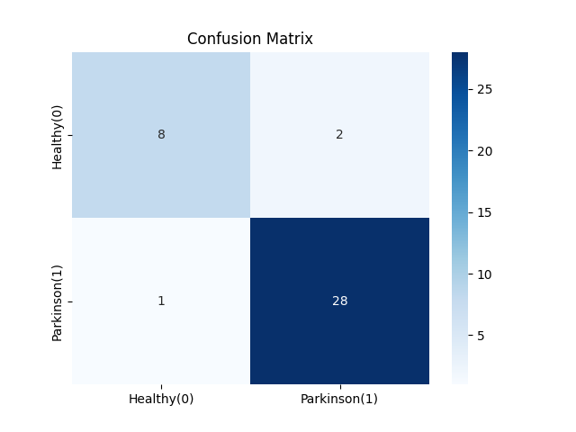

# Parkinson’s Disease Classification

Uses a **RandomForest** to predict Parkinson’s disease (`status=1`) vs. healthy (`status=0`) from the [Parkinson’s dataset](https://www.kaggle.com/datasets/vikasukani/parkinsons-disease-data-set/data). Typically achieves about **92% accuracy**.

## Visualizations

## Process
1. **Load** `parkinsons.data`
2. **EDA**: correlation heatmap, quick stats  
3. **Train/Test Split** (80/20) + **Scaling**  
4. **RandomForest** (`n_estimators=100`)  
5. **Evaluate** accuracy (~92%) + classification report
